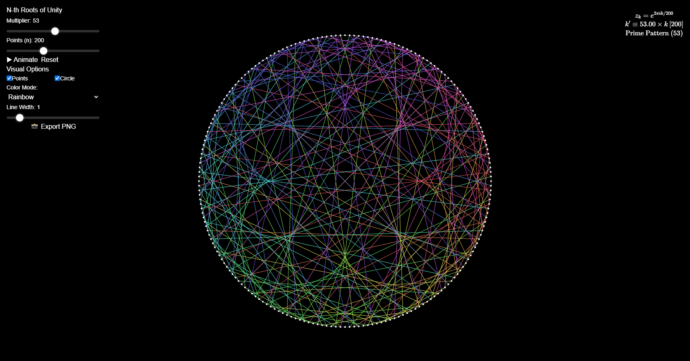

# N-th Roots of Unity Visualization

An interactive mathematical visualization that plots the n-th roots of unity on the complex plane and dynamically connects them using modular multiplication to reveal beautiful geometric patterns.



## 🔬 Mathematical Foundation

### Core Concept
The n-th roots of unity are complex numbers that satisfy the equation z^n = 1. They can be expressed using Euler's formula:

```
z_k = e^(2πik/n) = cos(2πk/n) + i·sin(2πk/n)
```

Where:
- `k = 0, 1, 2, ..., n-1` (indices of the roots)
- `n` is the total number of roots
- Each `z_k` represents a point on the unit circle in the complex plane

### Pattern Generation
The visual patterns are created by connecting each root `z_k` to `z_{(k × multiplier) % n}`, where:
- `multiplier` is a dynamic parameter that determines the connection pattern
- The modulo operation ensures we stay within the valid range of roots
- Different multipliers create different geometric patterns (cardioids, roses, etc.)

## 🎨 Visual Features

### Interactive Controls
- **n (Number of Roots)**: Controls how many points are placed around the unit circle
- **Multiplier**: Determines the connection pattern between points
- **Animation**: Automatically evolves the multiplier to show pattern transitions
- **Display Options**: Toggle between polar and Cartesian coordinate labels

### Pattern Examples
- `multiplier = 2`: Creates a cardioid (heart-shaped curve)
- `multiplier = 3`: Forms a nephroid (kidney-shaped curve)
- `multiplier = 4`: Generates a three-cusped epicycloid
- Prime multipliers often create the most interesting patterns

## 🛠️ Implementation Options

### Web Version (Recommended)
```bash
# Tech Stack
- Next.js 15 & TypeScript
- Tailwind CSS
- KaTeX (for math rendering)
- HTML5 Canvas API
```

**Advantages:**
- Interactive and responsive
- Easy to share and deploy
- Cross-platform compatibility
- Real-time parameter adjustment


## 🚀 Getting Started

### Prerequisites
- Node.js 18+ (for web version)
- Basic understanding of complex numbers and trigonometry

### Installation

#### Web Version
```bash
git clone https://github.com/khabzox/times-table-visualizer.git
cd times-table-visualizer
npm install
npm run dev
```

## 🎯 Key Learning Outcomes

### Mathematical Concepts
1. **Complex Numbers**: Understanding polar and Cartesian representations
2. **Euler's Formula**: The relationship between exponentials and trigonometry
3. **Modular Arithmetic**: How remainder operations create cyclic patterns
4. **Unit Circle**: Trigonometric functions and their geometric interpretations

### Programming Skills
1. **Mathematical Visualization**: Translating equations into visual representations
2. **Interactive UI**: Creating responsive controls for parameter manipulation
3. **Animation**: Smooth transitions and real-time updates
4. **Performance Optimization**: Efficient rendering of complex geometric patterns

## 📊 Pattern Gallery

### Famous Curves Generated
- **Cardioid** (n=200, multiplier=2): Heart-shaped curve from circle rolling around another circle
- **Nephroid** (n=200, multiplier=3): Two-cusped curve, envelope of circles
- **Deltoid** (n=200, multiplier=4): Three-cusped hypocycloid
- **Astroid** (n=200, multiplier=5): Four-cusped hypocycloid

### Interesting Observations
- When `gcd(multiplier, n) = 1`, the pattern connects all points
- Prime multipliers often create the most symmetric patterns
- Large values of n create smoother, more continuous curves
- Certain multiplier ratios create self-similar fractal-like structures

## 🔧 Advanced Features

### Customization Options
- **Color Schemes**: Different palettes for various mathematical themes
- **Line Styles**: Solid, dashed, gradient, or animated connections
- **Export Options**: Save patterns as SVG, PNG, or mathematical data
- **Multiple Layers**: Overlay different multipliers for complex compositions

### Educational Mode
- **Step-by-Step Visualization**: Show how each connection is calculated
- **Formula Display**: Real-time display of mathematical expressions
- **Interactive Tutorials**: Guided exploration of key concepts
- **Quiz Mode**: Test understanding of pattern predictions

## 📚 Further Reading

### Mathematical Background
- "Visual Complex Analysis" by Tristan Needham
- "The Geometry of Complex Numbers" by Hans Schwerdtfeger
- Online resources on cyclotomic polynomials and Galois theory

### Related Visualizations
- Spirographs and mathematical art
- Fourier series and epicycles
- Mandelbrot and Julia sets
- Lissajous curves and parametric equations

## 🤝 Contributing

We welcome contributions that enhance the mathematical accuracy, visual appeal, or educational value of this project. Areas of particular interest:

- Additional curve families and pattern types
- Performance optimizations for large n values
- Educational content and tutorials
- Mobile-responsive design improvements

## 📄 License

This project is open source and available under the MIT License. Feel free to use, modify, and distribute for educational and research purposes.

## 🙏 Acknowledgments

Inspired by the mathematical beauty revealed through computational visualization and the rich history of complex analysis and geometric pattern generation.

---

*"Mathematics is the art of giving the same name to different things." - Henri Poincaré*

Transform mathematical abstractions into visual discoveries with this interactive exploration of the n-th roots of unity!